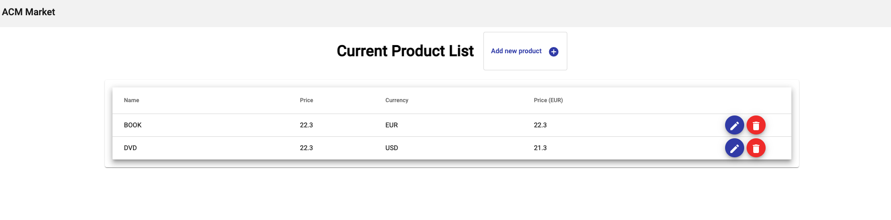
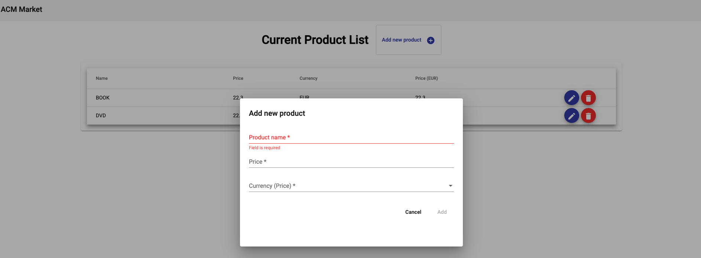
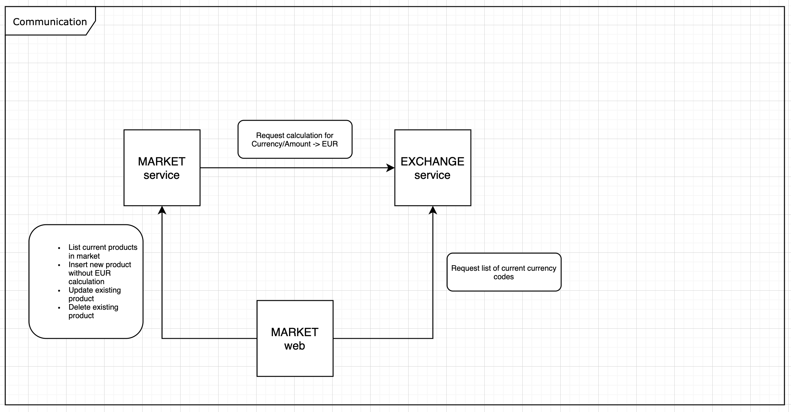
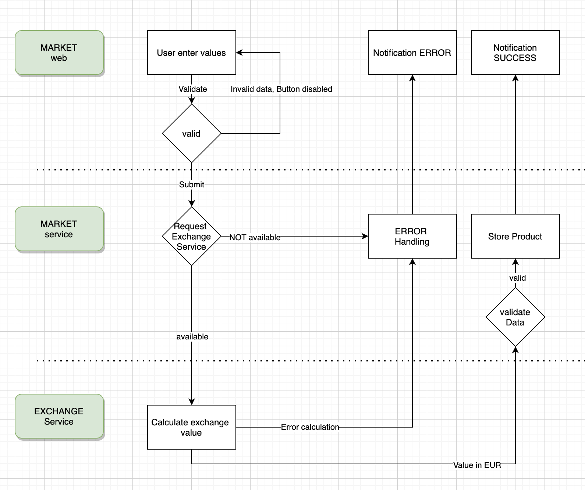
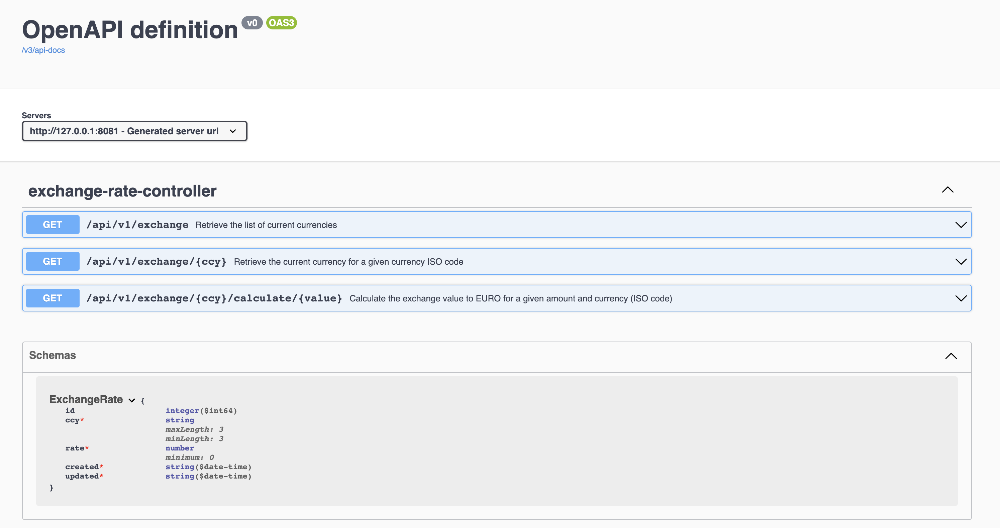
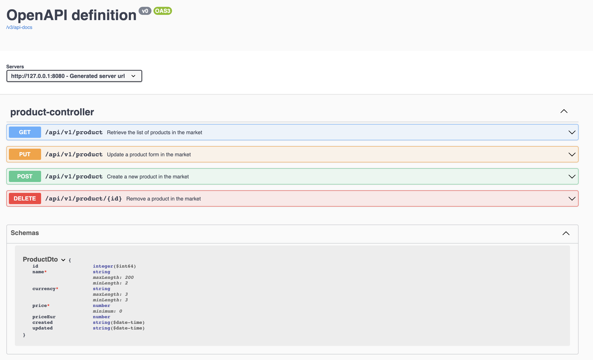
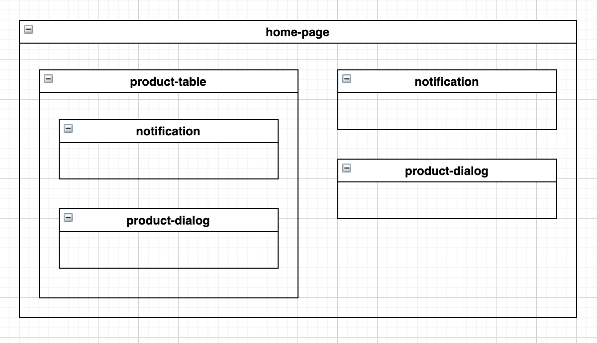

= ACM - MARKET

== Introduction

ACM-Market is a small POC, composed of 3 modules, kept on the basic Frameworks Java(Spring) and Angular without tools like RabbitMQ, Kafka or other communication Frameworks. The implementation is based on purely REST communication.

The application represent a simple CRUD interface to add/modify and delete products to the market. On adding a new product to the market, the user selects the product currency, which is transformed on the backend side to EUR, by a request to the second service in the application [exchange].

*Home screen*

*Popup window for requesting a new product*

The easiest way to start the applicat is with Docker: #docker-compose up# without docker, you need to build each module (Java/Maven, Angular/NPM) and start each module individually.

The application can be accessed:

* with Docker on: http://127.0.0.1/
* with each module individually on: http://127.0.0.1:4200/

== Component - Communication

=== Schema and description

The POC is based on 3 components with different roles:

* EXCHANGE service
** inventory for the latest exchange rate.
** Calculating value in EUR by receiving the amount and 2nd currency.
** REST entry points defined with CrossOrigin, to grant access to market-web.
** To be defined: Frequency of actualisation, visibility and security, resilience of service.
** Possible extensions: History, Validation.
** ...

* MARKET service
** inventory for the current state of products in the market.
** Request EUR value from the exchange service and apply it before storing in database.
** REST entry points defined with CrossOrigin, to grant access to market-web.
** to be defined: security, resilience, modifying a price of product and applied currency, update currency and cache.
** ...

* MARKET web
** user interface for handling products in the market.
** to be defined: security, resilience, integrate WEB-UI in the module market with as example (com.github.eirslett::frontend-maven-plugin).
** ...

Also, a point for reflection, the resilience of this environment, in case one of the components is not accessible. What is the impact and strategy to apply for the different scenarios.

=== Workflow for a new product

For adding a new product to the market the following steps are executed:

* The user click on add new product.
* A popup window get visible. The form (Angular React-Form) keeps the button add disabled as long the form is not valid.
* The user submit the form.
* The MARKET-service receives the data and validate the DTO against the rules defined in the DTO (JSR-303).
* The MARKET-service request the EUR value for the given amount and currency from the exchange service. Requesting the calculation by Backend guarantee that the exchange rate could not be injected by the user. (A condition to not request values in EUR, could be used to reduce the number of requests). The calculation request is a SYNC operation, done with a Spring Rest-Template in calling the REST-API of EXCHANGE-service.
* The EXCHANGE-service calculate the exchange value, when the currency is known in his database. In case of a success, the result will be returned, in other case an error will be transmitted.
* In case of a success return, the information will be validated against the JSR-303 entity definition and stored in the database.
* In case of any error during the Backend-operation, the exception passed by a global @RestControllerAdvice and in case of a matching definition handled by it.

== REST Services

=== Swagger Information

The java application (exchange & market) contains the [springdoc-openapi-ui] as dependency, for presenting the API REST documentation in Swagger format.

Exchange API View (http://127.0.0.1:8081/swagger-ui.html):

Market API View (http://127.0.0.1:8080/swagger-ui.html):

== Angular UI Components

The application is based on a simple component tree:

=== home-page
The main component contain the components [product-table][product-dialog][notification]. The component displays the table and contains the action to add a new product by the product-dialog.

=== product-table
The component contain the components [product-dialog][notification]. The component lists the products and contains the action to update a product with the product-dialog and delete a product.

=== product-dialog
The component is based on a Angular React Form with validation rules and can be used to add or delete a product.

=== notification
The component is a simple Wrapper for the Angular Material SnackBar to show messages (SUCCESS/ERROR) to the user.

== Stack Technology

=== Java

* JDK 16
* Spring Boot 2.5.6
* Spring Boot JPA
* Spring Boot Web
* Spring Boot Validation
* Spring Boot Actuator
* Spring Boot Test
* Flyway
* H2 Database
* Mockito
* Springdoc Openapi

=== Angular

* Angular 12
* Angular Material
* RxJs

<<<

== Annexe

=== H2 Database + Flyway

The implementation for an H2 database in Spring has only a couple of configuration to do, as it is a POC we keep it light:

*Maven Dependencies (H2 + JPA)*

    <dependency>
        <groupId>org.springframework.boot</groupId>
        <artifactId>spring-boot-starter-data-jpa</artifactId>
    </dependency>
    <dependency>
        <groupId>com.h2database</groupId>
        <artifactId>h2</artifactId>
        <scope>runtime</scope>
    </dependency>

Configuration Spring Boot (database part in application.properties)

 # Database (H2)
 spring.datasource.url=jdbc:h2:file:./h2/market-dev-db
 spring.datasource.driverClassName=org.h2.Driver
 spring.datasource.username=sa
 spring.datasource.password=password
 spring.jpa.database-platform=org.hibernate.dialect.H2Dialect
 # http://localhost:8080/h2-console/
 spring.h2.console.enabled=true
 # JPA
 spring.jpa.hibernate.ddl-auto=validate
 spring.jpa.show-sql=true

*Maven Dependencies (Flyway)*

    <dependency>
        <groupId>org.flywaydb</groupId>
        <artifactId>flyway-core</artifactId>
    </dependency>

Configuration Spring Boot (Flyway part in application.properties)

 # Flyway
 spring.flyway.enabled=true
 spring.flyway.user=sa
 spring.flyway.password=password
 spring.flyway.url=jdbc:h2:file:./h2/market-dev-db

*Database Schema*

The schema and database is stored under the project resource folder (resources/db/migration)

V1_0_0__database_schema.sql : containing the schema

V1_0_1__data.sql  product-table: containing a set of example data

as the schema is created by flyway, in JPA we only validate the entity model against the database: (spring.jpa.hibernate.ddl-auto=validate).

As the application can be started with different Spring profiles, a configuration for the database or application port (server.port=8080) can be customized for purpose. An activation can be done in adding [-Dspring.profiles.active=dev], defining an environment variable [export spring_profiles_active=dev], or like in the POC, define the default profile in application.properties.

=== Docker

The application can be run in Docker for this the Java and Angular modules are build by the multi stage scripts (Build Stage + Run Stage).

Run the Docker with: #docker-compose up#

Docker image: exchange
[source,dockerfile]
----
include::exchange/Dockerfile[]
----

Docker image: market
[source,dockerfile]
----
include::market/Dockerfile[]
----

Docker image: market-web
[source,dockerfile]
----
include::market-web/Dockerfile[]
----
